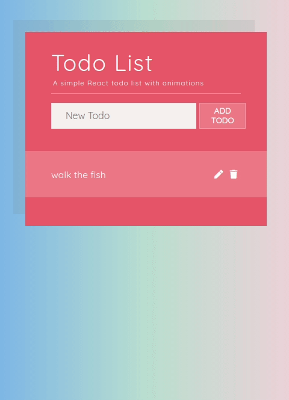

# Featured

## 👑 Regalia Clothing 👚 (fully functioning E-commerce ReactJS/Redux/NodeJS/Stripe payment app)

- [Live Demo](https://fervent-snyder-0eb669.netlify.app/#/)

- [Code Repo here](https://github.com/boostup/regalia-clothing)

- [Project PR history][featuredpullrequesthistory]

- [Project Kanban board][featuredkanbanproject]

# E-commerce demo

## Stripe checkout with Netlify functions (serverless NodeJS) w/ Vanilla HTML/CSS/JS

- [Live Demo](https://boostup-stripe-checkout-netlify-serverless.netlify.app/)

- [Code Repo here](https://github.com/boostup/stripe-checkout-netlify-serverless)

# Demo Games

## Lights Out Game

- [Live Demo](https://pedantic-stonebraker-c10870.netlify.app/)

- [Code Repo here](https://github.com/boostup/react-lights-out)

---

## Yahtzee!

- [Live Demo](https://upbeat-bose-8f59b4.netlify.app/)

- [Code Repo here](https://github.com/boostup/react-yahtzee)

# Demo Apps

## Color Palette Composition App

- [Live Demo](https://boostup.github.io/react-colors-app/)

- [Code Repo here](https://github.com/boostup/react-colors-app)

---

## COVID 19 Tracker Responsive App

- [Live Demo](https://boostup-covid19-tracker.netlify.app/)

- [Code Repo here](https://github.com/boostup/react-covid19-tracker)

---

## Pizza Order Animated & Responsive App

- [Live Demo](https://jolly-galileo-8826ac.netlify.app/)

- [Code Repo here](https://github.com/boostup/framer-motion-pizza-joint-exercise)

---

## Todo App (React, Material UI, Hooks, Context API)

- [Live Demo](https://boostup.github.io/react-hooks-mui-todo-app/)

- [Code Repo here](https://github.com/boostup/react-hooks-mui-todo-app)

---

## Simple Todo App with animations

- [Live Demo](https://confident-shockley-90b9a0.netlify.app/)

- [Code Repo here](https://github.com/boostup/react-todo-app-with-animations)

# Demo UI Widgets

## Animated & Responsive menu header

- [Live Demo](https://agitated-euclid-9c1938.netlify.app/)

- [Code Repo here](https://github.com/boostup/react-framer-motion-react-router-dom-route-transition)

---

## Animated drawer menu

- [Live Demo](https://admiring-knuth-8cd550.netlify.app/)

- [Code Repo here](https://github.com/boostup/framer-motion-side-menu-exercise)

---

## Animated dropdown menu demo "a la facebook"

- [Live Demo](https://laughing-pare-6fcdf7.netlify.app/)

- [Code Repo here](https://github.com/boostup/react-demo-widgets/tree/master/facebook-dropdown-clone)

---

## Login widget (Material UI, localized, dark mode, context API)

- [Live Demo](https://nervous-wescoff-fd3b90.netlify.app/)

- [Code Repo here](https://github.com/boostup/react-demo-widgets/tree/master/material-ui-localized-login-with-dark-mode)

[featuredkanbanproject]: https://github.com/boostup/regalia-clothing/projects/1
[featuredpullrequesthistory]: https://github.com/boostup/regalia-clothing/pulls?q=is%3Apr
