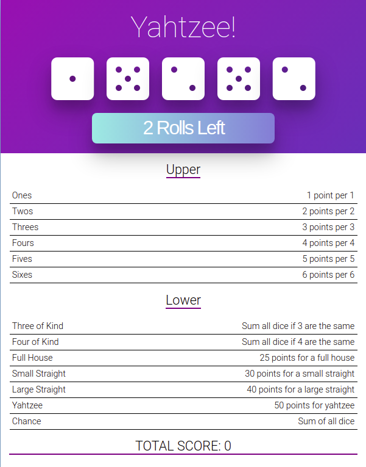
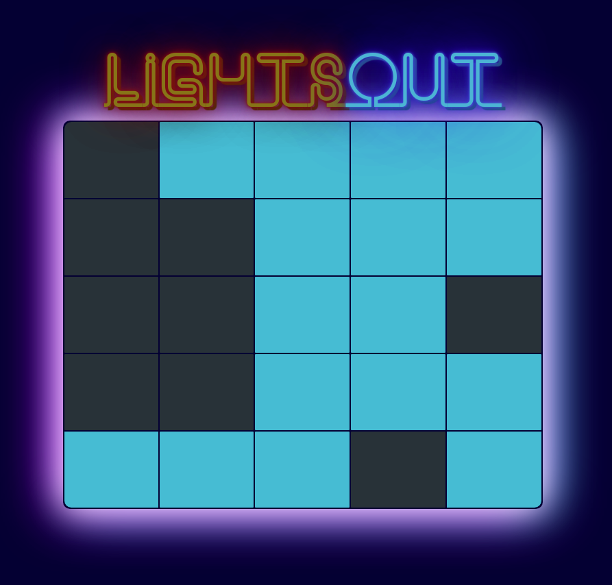
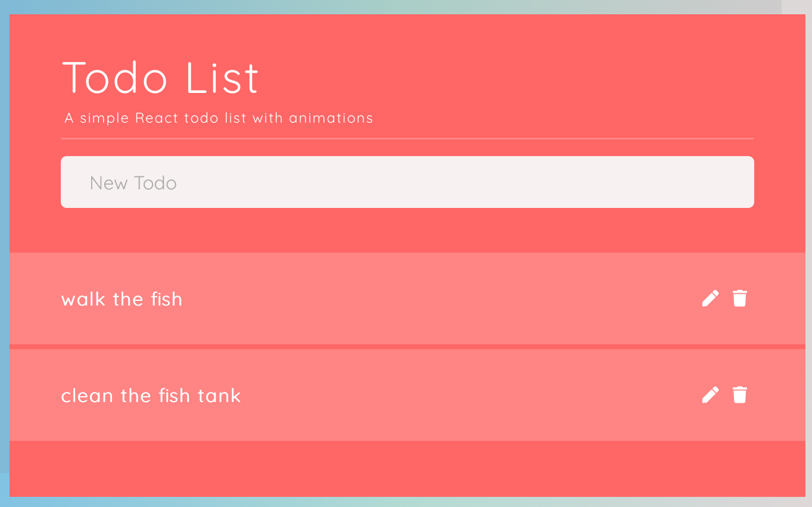
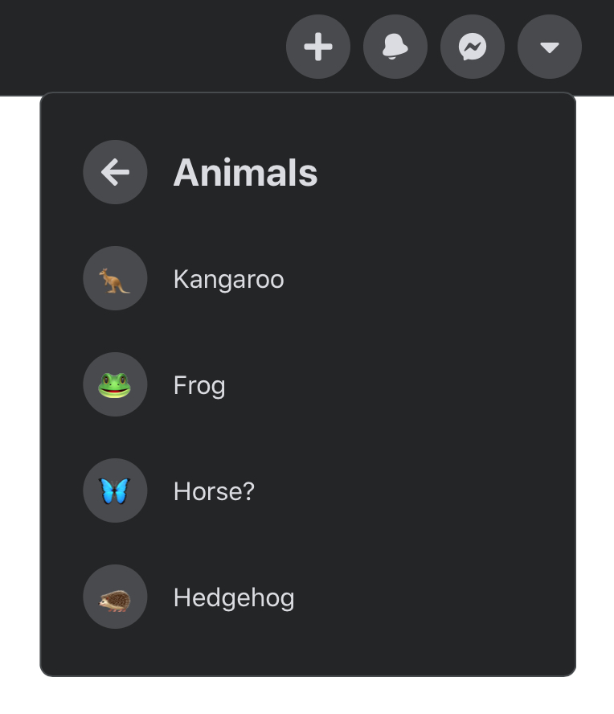

# Demo Games

## Yahtzee!

- [Live Demo](https://upbeat-bose-8f59b4.netlify.app/){:target="\_blank"}

- [Code Repo here](https://github.com/boostup/react-yahtzee){:target="\_blank"}

## Lights Out Game

- [Live Demo](https://pedantic-stonebraker-c10870.netlify.app/){:target="\_blank"}

- [Code Repo here](https://github.com/boostup/react-lights-out){:target="\_blank"}

{:width="400px"}

# Demo Apps

## Color Palette Composition App

- [Live Demo](https://boostup.github.io/react-colors-app/){:target="\_blank"}

- [Code Repo here](https://github.com/boostup/react-colors-app){:target="\_blank"}

## Simple Todo App with animations

- [Live Demo](https://confident-shockley-90b9a0.netlify.app/){:target="\_blank"}

- [Code Repo here](https://github.com/boostup/react-todo-app-with-animations){:target="\_blank"}

## Todo App (React, Material UI, Hooks, context API)

- [Live Demo](https://boostup.github.io/react-hooks-mui-todo-app/){:target="\_blank"}

- [Code Repo here](https://github.com/boostup/react-hooks-mui-todo-app){:target="\_blank"}

## COVID 19 Tracker

- [Live Demo](https://boostup-covid19-tracker.netlify.app/){:target="\_blank"}

- [Code Repo here](https://github.com/boostup/react-demo-apps/tree/master/covid19-tracker){:target="\_blank"}

# Demo UI Widgets

## Multilevel dropdown menu demo "a la facebook"

- [Live Demo](https://laughing-pare-6fcdf7.netlify.app/){:target="\_blank"}

- [Code Repo here](https://github.com/boostup/react-demo-widgets/tree/master/facebook-dropdown-clone){:target="\_blank"}

{:width="300px"}

## Login widget (Material UI, localized, dark mode, context API)

- [Live Demo](https://nervous-wescoff-fd3b90.netlify.app/){:target="\_blank"}

- [Code Repo here](https://github.com/boostup/react-demo-widgets/tree/master/material-ui-localized-login-with-dark-mode){:target="\_blank"}

