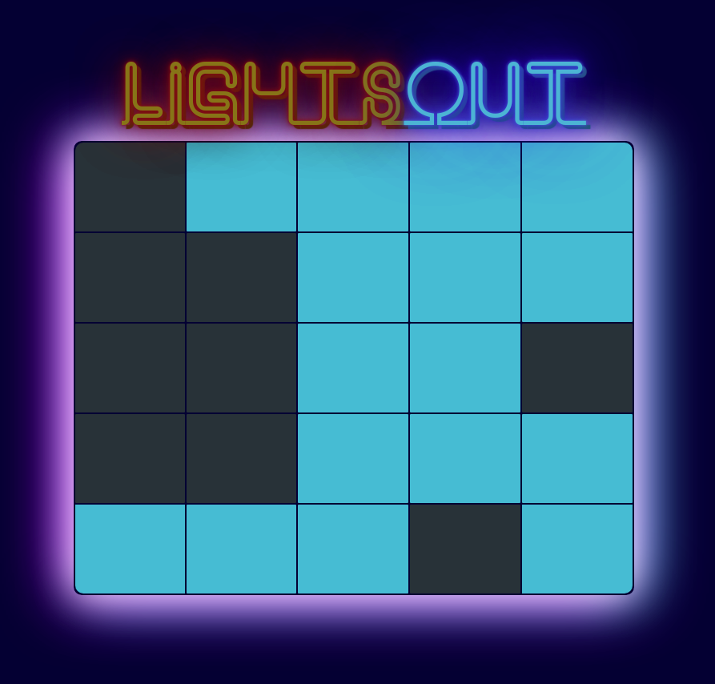
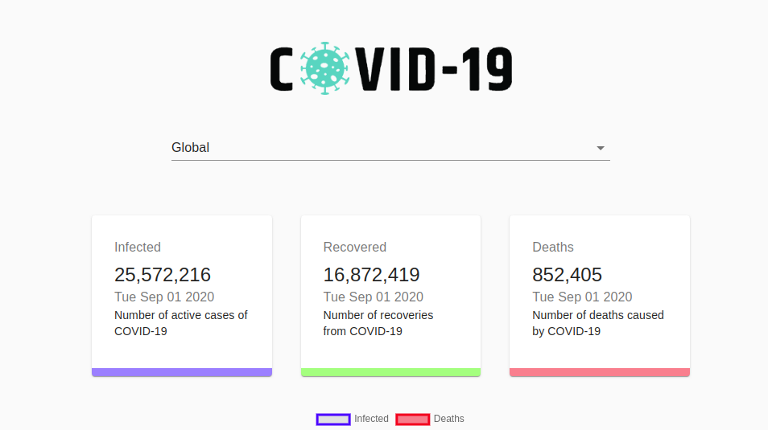

## Color Palette Composition App

- [Live Demo](https://boostup.github.io/react-colors-app/)

- [Code Repo here](https://github.com/boostup/react-colors-app)

## Lights Out Game

- [Live Demo](https://pedantic-stonebraker-c10870.netlify.app/)

- [Code Repo here](https://github.com/boostup/react-lights-out)

## Todo App (React, Material UI, Hooks, context API)

- [Live Demo](https://boostup.github.io/react-hooks-mui-todo-app/)

- [Code Repo here](https://github.com/boostup/react-hooks-mui-todo-app)

## Login widget (Material UI, localized, dark mode, context API)

- [Live Demo](https://nervous-wescoff-fd3b90.netlify.app/)

- [Code Repo here](https://github.com/boostup/react-demo-widgets/tree/master/material-ui-localized-login-with-dark-mode)

## COVID 19 Tracker

- [Live Demo](https://boostup-covid19-tracker.netlify.app/)

- [Code Repo here](https://github.com/boostup/react-demo-apps/tree/master/covid19-tracker)

