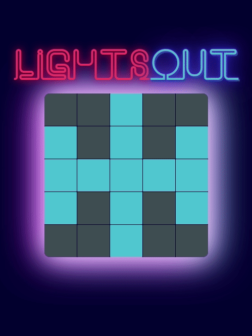
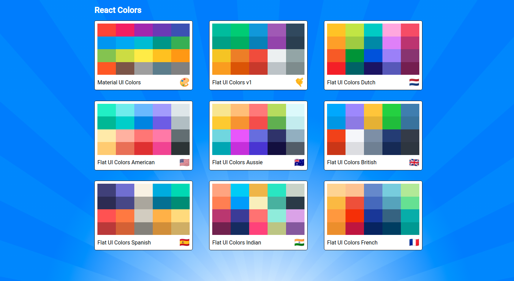
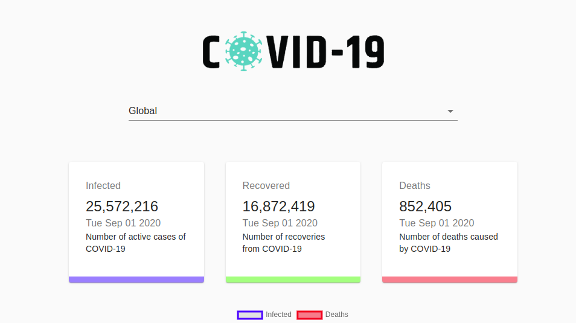
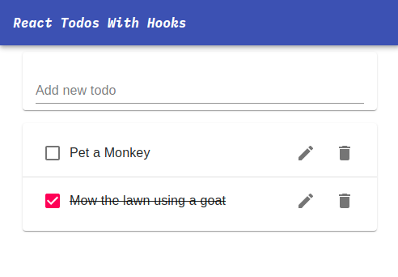
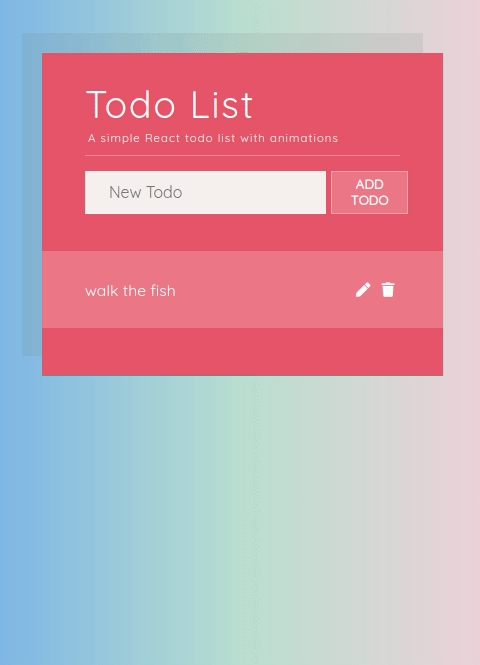
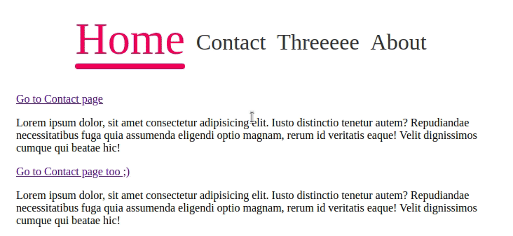
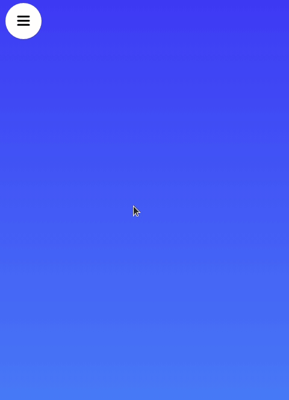
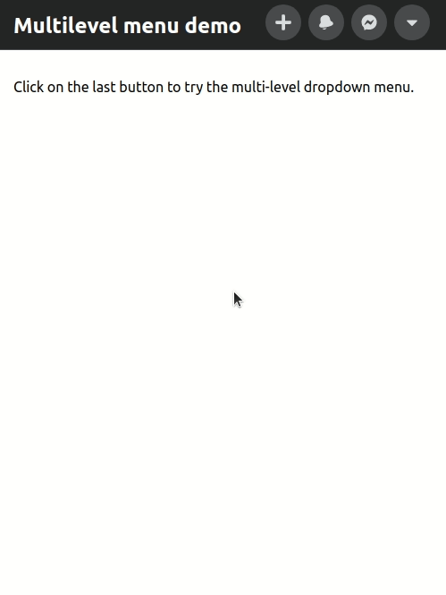
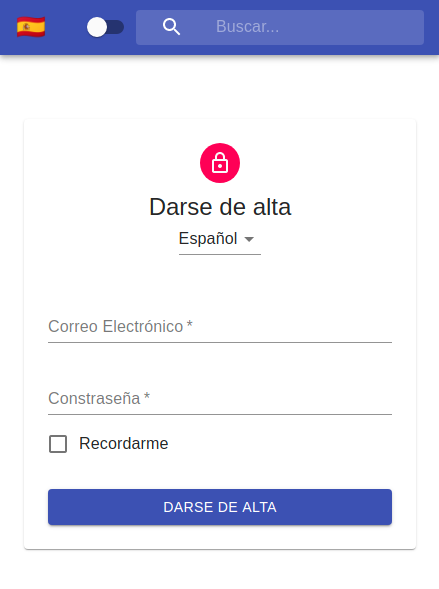

# Featured

## 👑 Regalia Clothing 👚 (fully functioning E-commerce ReactJS/Redux/NodeJS/Stripe payment app)

- [Live Demo](https://fervent-snyder-0eb669.netlify.app/#/){:target="\_blank"}

- [Code Repo here](https://github.com/boostup/regalia-clothing){:target="\_blank"}

- 👍 **See how the app was built step-by-step** 👍 thanks to the chronological [pull requests history](https://github.com/boostup/regalia-clothing/pulls?page=2&q=is%3Apr+is%3Aclosed+sort%3Acreated-asc){:target="\_blank"}

{:width="600px"}

# E-commerce demo

## Stripe checkout with Netlify functions (serverless NodeJS) w/ Vanilla HTML/CSS/JS

- [Live Demo](https://boostup-stripe-checkout-netlify-serverless.netlify.app/){:target="\_blank"}

- [Code Repo here](https://github.com/boostup/stripe-checkout-netlify-serverless){:target="\_blank"}

# Demo Games

## Lights Out Game

- [Live Demo](https://pedantic-stonebraker-c10870.netlify.app/){:target="\_blank"}

- [Code Repo here](https://github.com/boostup/react-lights-out){:target="\_blank"}

---

## Yahtzee!

- [Live Demo](https://upbeat-bose-8f59b4.netlify.app/){:target="\_blank"}

- [Code Repo here](https://github.com/boostup/react-yahtzee){:target="\_blank"}

# Demo Apps

## Color Palette Composition App

- [Live Demo](https://boostup.github.io/react-colors-app/){:target="\_blank"}

- [Code Repo here](https://github.com/boostup/react-colors-app){:target="\_blank"}

---

## COVID 19 Tracker Responsive App

- [Live Demo](https://boostup-covid19-tracker.netlify.app/){:target="\_blank"}

- [Code Repo here](https://github.com/boostup/react-covid19-tracker){:target="\_blank"}

---

## Pizza Order Animated & Responsive App

- [Live Demo](https://jolly-galileo-8826ac.netlify.app/){:target="\_blank"}

- [Code Repo here](https://github.com/boostup/framer-motion-pizza-joint-exercise){:target="\_blank"}

---

## Todo App (React, Material UI, Hooks, Context API)

- [Live Demo](https://boostup.github.io/react-hooks-mui-todo-app/){:target="\_blank"}

- [Code Repo here](https://github.com/boostup/react-hooks-mui-todo-app){:target="\_blank"}

---

## Simple Todo App with animations

- [Live Demo](https://confident-shockley-90b9a0.netlify.app/){:target="\_blank"}

- [Code Repo here](https://github.com/boostup/react-todo-app-with-animations){:target="\_blank"}

# Demo UI Widgets

## Animated & Responsive menu header

- [Live Demo](https://agitated-euclid-9c1938.netlify.app/){:target="\_blank"}

- [Code Repo here](https://github.com/boostup/react-framer-motion-react-router-dom-route-transition){:target="\_blank"}

---

## Animated drawer menu

- [Live Demo](https://admiring-knuth-8cd550.netlify.app/){:target="\_blank"}

- [Code Repo here](https://github.com/boostup/framer-motion-side-menu-exercise){:target="\_blank"}

---

## Animated dropdown menu demo "a la facebook"

- [Live Demo](https://laughing-pare-6fcdf7.netlify.app/){:target="\_blank"}

- [Code Repo here](https://github.com/boostup/react-demo-widgets/tree/master/facebook-dropdown-clone){:target="\_blank"}

---

## Login widget (Material UI, localized, dark mode, context API)

- [Live Demo](https://nervous-wescoff-fd3b90.netlify.app/){:target="\_blank"}

- [Code Repo here](https://github.com/boostup/react-demo-widgets/tree/master/material-ui-localized-login-with-dark-mode){:target="\_blank"}
  {:width="300px"}

